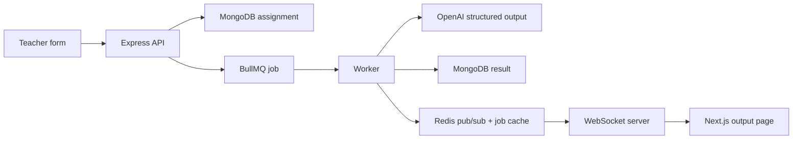

# VedaAI Assessment Creator

An end-to-end AI assessment creator for teachers. The app collects assignment settings, queues a generation job, produces a structured question paper with OpenAI, stores the result, and streams status updates back to the frontend over WebSockets.

## Stack

- Frontend: Next.js, TypeScript, Zustand, native WebSocket client
- Backend: Node.js, Express, TypeScript
- Data: MongoDB for assignments and generated results
- Jobs: Redis + BullMQ for generation jobs and cached job state
- AI: OpenAI Responses API with structured output parsing
- Export: Structured PDF generation with `@react-pdf/renderer`
- Auth: Email/password accounts, bcrypt password hashing, JWT sessions, owner-scoped assignments

## Architecture



The frontend and backend share Zod schemas from `packages/shared`, so form validation and generated paper parsing use the same contracts.

Assignments are stored with an `ownerId`, and every assignment API route checks the signed-in user before returning or mutating data.

## Quick Start

```bash
cp .env.example .env
npm install
docker compose up -d
npm run dev
```

Open [http://localhost:3000](http://localhost:3000).

Set `OPENAI_API_KEY` in `.env` for real OpenAI generation. The default model is `gpt-5-nano` to keep demo costs low, and `OPENAI_MODEL` can be changed without code edits.

For a public deployment, see [DEPLOYMENT.md](DEPLOYMENT.md).

## Free Hosted Demo Mode

The deployment config keeps backend platform spend at `0`: Render runs the API, WebSocket server, and BullMQ worker inside one Free web service with `RUN_WORKER_IN_API=true`, plus one Free Render Key Value instance. MongoDB Atlas stores durable user and assignment data.

For production, run the worker separately with `npm --workspace @vedai/api run start:worker`.

## Dev Fallbacks

If MongoDB or Redis is not running, the API falls back to in-memory storage and an in-process queue so the demo still works locally. For the required production flow, run `docker compose up -d` so MongoDB, Redis, BullMQ, and the worker path are active.

## Scripts

```bash
npm run dev        # API, worker, and Next app
npm run build      # Next build + TypeScript checks
npm run typecheck  # all workspaces
npm --workspace @vedai/api run smoke:openai  # live structured-output check, requires OPENAI_API_KEY
```

## API

- `POST /api/assignments` accepts multipart form data with optional `sourceFile`.
- `GET /api/assignments` returns the signed-in teacher's saved assignments.
- `GET /api/assignments/:id` returns assignment status and result.
- `POST /api/assignments/:id/regenerate` queues a fresh generation run.
- `ws://localhost:4000/ws?assignmentId=...` streams assignment updates.
- `POST /api/auth/register`, `POST /api/auth/login`, `GET /api/auth/me`, and `POST /api/auth/logout` manage user sessions.

## Notes

- The UI never renders raw model output. OpenAI responses are parsed against `generatedAssessmentSchema` before storing or displaying.
- PDF export is generated from the structured assessment object rather than browser print.
- Uploaded `.pdf`, `.txt`, and `.md` files are accepted as source material.
